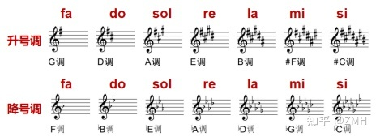
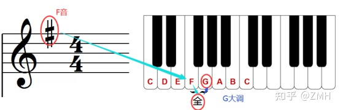
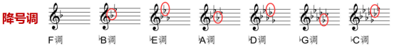
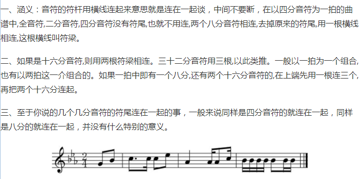
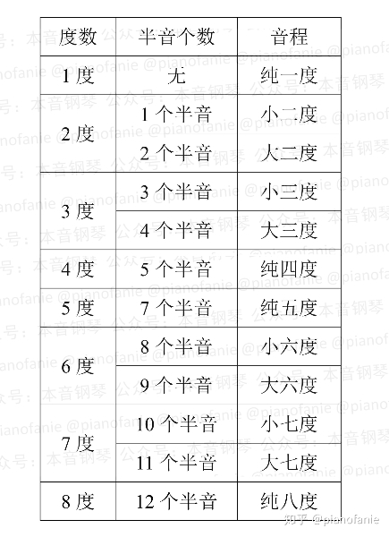
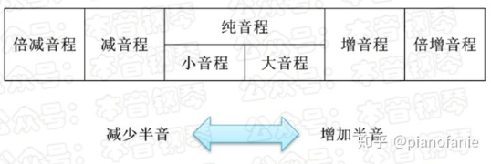

# 基本概念

## [节奏](https://zhuanlan.zhihu.com/p/35416126)

包含四要素：节拍、速度、重音和 pattern

## [五线谱](https://zhuanlan.zhihu.com/p/60355971)

### 线和间

从下往上数，五线四间，A~G 的音符顺序依次分布到线和间。

### 谱号

| 符号        | 谱号音符在哪条线 | 手   | 线上的音符 | 间上的音符 |
| ----------- | ---------------- | ---- | ---------- | ---------- |
| 高音谱号(G) | 2 线             | 右手 | E G B D F  | F A C E    |
| 低音谱号(F) | 4 线             | 左手 | G B D F A  | A C E G    |
| 中音谱号(C) |                  |      |            |            |

### [调性](https://zhuanlan.zhihu.com/p/358402914)

分清楚：调性、调性的名称（C 大调）、调号（#FA）

#### 大调音阶：全全半全全全半

如：C 大调

1. 主音是音阶中最突出的音符，音阶以主音命名，主音决定演奏的调，C 大调以 C 为主音。
2. 遵循这个模式，可以在任何音符上开始一个大调音阶。
3. 除 C 大调外的其他大调需要使用升调和降调。乐谱的升/降调（调号）写在谱号和拍号之间，在音乐中这些音符需要保持升/降调，除非有还原记号覆盖它。
4. C 大调音阶的：EF 和 BC 之间是半音

如：G 大调：升 F

#### 如何记住和认识调号

##### 高音谱号

1. 调号是固定的，以 5 度的关系为基础来增长，因此调号会固定标在五线谱的固定位置：不管有几个升号，第一个都是升 fa，第二个是升 do，以此类推。

2. 最右边的调号所在的五线谱位置所对应的音名（不看升降记号），向上加一个全音，就是调的名称。

3. 由 C 开始，+4 到 G；由#在 F 线的 F，加一个全音到 G。

#### [十二个大调音阶](https://zhuanlan.zhihu.com/p/104836703)

(3+4)个白键 + (2+3)个黑键

##### 临时变音记号与调号（固定升降号）的作用范围

1. 横向看

临时变音记号作用于对应小节，调号作用于整首曲子。

2. 纵向看

临时变音记号作用于对应线或间的音（不能跨越谱号存在），调号作用于与对应线或间同音名的音。

##### 低音谱号

1. 右边第二个调号所在的五线谱位置所对应的音名，就是调的名称。

### 音符

1. 符头、符干、符尾

|            |          |            |            |            |              |
| ---------- | -------- | ---------- | ---------- | ---------- | ------------ |
| 音符时值   | 全音符   | 二分音符   | 四分音符   | 八分音符   | 十六分音符   |
| 休止符时值 | 全休止符 | 二分休止符 | 四分休止符 | 八分休止符 | 十六分休止符 |

2. 附点

3. 音符上的弧线是连音线，分为两种：延音线（又名同音连线）和圆滑线

4. 多个符头一个符干的音符：和弦（或叫和声），几个键同时按下

5. 几个音符符尾相连

### 半音

升记号、降记号、还原记号

升 C=降 D

### [如何快速看谱](https://www.zhihu.com/question/22803406)

找基准位置，相对基准位置快速定位

## 钢琴

88 键=白键 52+黑键 36
52 = 2 + (3 + 4) * 7 + 1
36 = 1 + (2 + 3) *7

### 音区和音域

音区是音域的一部分，有高音区、中音区、低音区三种。

在整个音域中，
中音区：小字组、**小字一组**（中间一组）、小字二组；
高音区：小字三组、小字四组、小字五组（一个 C）；
低音区：大字字组、大字一组、大字二组（A 和 B）。

### 五线谱如何对应钢琴的琴键

高音谱号的 G 在中央 C 键（小字一组的 C 键）右侧第五个白键上

## 乐理

### 音阶

音阶由 8 个连续的音符组成

### 音级

一组白键里，有 7 个基础音级。

### [音程](https://mp.weixin.qq.com/s/MA7kjTrs7kcyLxTZTyrUyA)

一个八度包含十二个半音

音程分两类：

1. 自然音程：大、小、纯、增四度、减五度
2. 变化音程：除了自然音程的其他增减音程

#### 同一个音高，用升号或降号标记的区别

1. 大调半音阶上行时是用降七级代替升六级，因为升 6 级不可能存在于任何关系调中，其余大二度间都是用升音级填入；
2. 大调半音阶上行降 7 不升 6，下行升 4 不降 5；
3. 小调半音阶上下行只能降 2 不能升 1；
4. 在大调下行半音进行中应用升 4 级代替降 5 级；
5. 从绝对音高上说，降 7 就是升 6，这样类似的例子有很多，至于什么时候叫降 7，什么时候叫升 6，这和乐理中“音程”的相关知识密切相关：

   半音阶的写法是以调性关系为依据的.每一个带有变音记号的音,在某种意义上,它已经成为“导音”,它需要“解决”,即由不稳定音解决到稳定音,稳定音即音阶中原来的自然音,所以,6 后面不能记写成#6,而要记写成 b7。

6. 带半音的音阶一般升降音取前面的还是后面的？
   七个音使用四个升号 三个降号.所以平时我们接触到的调大多是升 C 大调,升 G 大调,降 B 大调,降 E 大调等,而很少听说过降 G 降 F 升 A 升 B 等调。

#### 

音程的命名是先定音级数，再定音程关系的大小。

1. 几度计算是根据两个音（不看变音记号）在五线谱上的位置，而不是在琴键上的位置决定。这样才会产生增减音程。
2. 通过判断两个音之间有几个相邻白键是半音关系，即可判断是是哪种类型的音程。
   1. do 到 la 是 6 度。两个音之间只有 1 个半音，则是大六度；
   2. si 到 sol 是 6 度，两个音之间有两个半音，则是小六度。增减等在此基础结构之上找即可。
   3. 6 与降 7 的关系：6 7，两个音级，为二度音程；6 与降 7 是半音关系，因此为小二度音程；
   4. 6 与升 6 的关系：6 一个音级，为一度音程；6 与升 6 是半音关系，因此为增一度音程。

#### 

增减音程都是以大、小、纯三种音程为基础，通过增减半音得到。若增加半音，则向右移动一格；若减少半音，则向左移动一格。

### 音名

C D E F G A B

### 唱名

do re mi fa sol la si

### 音律

十二平均律

### [声部](https://zhuanlan.zhihu.com/p/68745036)

[待看超长乐理](https://zhuanlan.zhihu.com/p/31864712)

### 待解决问题

1. 为什么半音音阶后面的 6 不是升 6 而是降 7?
