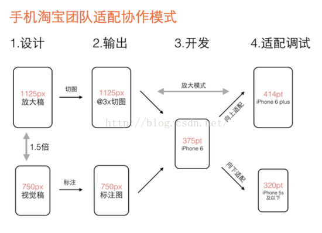

[css 单位计算和响应布局](https://blog.csdn.net/qq_33384402/article/details/107205840)
[屏幕适配](https://blog.csdn.net/zhw0596/article/details/97115541?utm_medium=distribute.pc_aggpage_search_result.none-task-blog-2~all~baidu_landing_v2~default-1-97115541.nonecase)

# 计算单位

- pt
- px
- em rem
- vw vh

px 定义线
em 定义间距
rem 定义字号
vw vh 定义容器

1pt = 1/72inch
1inch = dpi \* 1px （windows 默认为 96，ios 默认为 72）
=> 1pt = 4/3 px （windows）

大多数浏览器默认 HTML 的字号为 16px

---

这是一篇自下而上的文章，发现问题，找了解决方案，对为什么这么可以解决产生疑问？

### 项目中使用 pdfjs 查看 PDF 文件

（实现原理是：把 pdf 绘制在 canvas 上，以图片的位图形式展示）
问题：清晰度低
解决：[解决 canvas 在高清屏上绘制模糊的问题](https://cloud.tencent.com/developer/article/1501018)
拓展：文章中涉及的概念

解析：

1. canvas 类似于图片的位图模式展示，普通图片在高清屏上展示时，逻辑像素 1px 需要 dpr 个设备像素来展示。因此图片相当于被放大了 dpr 倍，图片模糊。
```js
canvas.width = viewport.width * ratio; // 1. canvas 放大 dpr 倍
context.setTransform(ratio, 0, 0, ratio, 0, 0); // 3. 绘制的元素也需要放大 dpr 倍
canvas.style.width = viewport.width + 'px'; // 2. canvas按照原尺寸展示
```

### 屏幕相关概念

1. 显示器的分辨率
   > 显示器是由一个个像素点(pixel)所组成的，一般所说的显示器分辨率是 1280x720 就表示这个显示器水平方向有 1280 个像素，垂直方向上有 720 个像素。但是并非分辨率越高屏幕显示效果越好，还需要根据屏幕的大小来决定。也就是要看像素的密度(pixel density)，这个指标就是 DPI(Dots Per Inch)或者 PPI(Pixels Per Inch)，即英尺屏幕上像素或者是点的个数。
2. 屏幕尺寸
   > 显示器对角线的长度
3. ppi(屏幕像素密度) / dpi(屏幕的解析度)

   PPI = Pixel Per Inch
   DPI = Dots Per Inch

   注：每英寸指的是：每对角线长度（屏幕尺寸）

   > dot 值的是显示器上每一个物理的点，而 pixel 指的是屏幕分辨率中的最小单位。

   二者的关系如下：
   dppx = Dots per pixel

   大部分显示器二者的值相同，但是目前比较好的屏幕 dppx 大于 1。

   Retina 屏（即二倍屏）：>= 300ppi，iPhone4 之前分辨率（320\*480），iPhone4 即 retina 屏的分辨率为 640\*960。

4. 对于分辨率，我们要从电视机、摄像机和图像格式三方面认识

### [像素 与 分辨率 ](https://zhuanlan.zhihu.com/p/162373853)

1. 设备像素（物理像素）
2. 设备独立像素=Device Independent Pixel/dpi（逻辑像素）

   > 设备独立像素就是在设备像素的基础上人为定义的一层逻辑像素。举个例子，一个屏幕的物理像素是 2560*1440，但是我们可以人为定义这个屏幕就是 1280*720，所以 1 个设备独立像素就用 4 个设备像素显示。传统的 pc 屏幕，1 个设备像素就等于 1 个设备独立像素；但是现在市面上有很多高清屏幕，比如苹果的 retina 屏幕，这是由于 1 个像素点用多个物理像素显示，所以高清屏的画质就更加锐利，没有颗粒感，显示效果出众。

   2.1 css 像素 是一个视角单位。

3. dpr=device pixels ratio(设备像素比)
   3.1 dpr 描述的是未缩放状态下，物理像素和 CSS 像素的初始比例关系
   设备像素比(dpr) 是指在移动开发中 1 个 css 像素占用多少设备像素，比如 dpr=2 就代表 1 个 css 像素用 2x2 个设备像素来绘制。

   3.2 dpr 由这台设备的 PPI/160(标准 PPI) 得到的。在标准普通屏 PPI（160）下，设备像素比为 1:1，1 个设备像素(物理像素)对应 1 个 css 像素。

4. DPR 和 PPI 的对应关系
   不同平台定义 DPR 的基线 PPI 是不同的。

   4.1 由于第一代 iPhone 的 PPI 是 163，所以苹果把 163 作为缩放基线。

   在 iPhone 中，PPI=163 是 1x 屏；PPI=326 是 2x 屏；PPI=401 是 3x 屏；PPI=458 也是 3x 屏，对应的 DPR 分别为 1、2、3、3。

   4.2 而 Android 屏幕的缩放基线 PPI 是 160，所以 PPI=160 是 1x 屏，PPI=320 是 2x 屏。

### viewport 与 移动前端开发基础知识

1. viewport 是浏览器（或者 webview）用来显示网页的区域，不局限与浏览器的可视区域大小。当 viewport 大于可视区域时，会出现滚动条。各设备上浏览器 viewport 的默认值：一般为 980px，少数为 1024px（blackberry、ie）。

2. css 的 1px 不等于设备的 1px
   2.1 设备的分辨率不同

   > 所谓的一倍屏、二倍屏（Retina）、三倍屏，指的是设备以多少物理像素来显示一个 css 像素，也就是说，多倍屏以更多更精细的物理像素点来显示一个 css 像素点，在普通屏幕下的 1 个 css 像素对应一个物理像素，而在 Retina 屏幕下，1css 像素对应的却是 4 个物理像素。

   2.2 用户缩放

   > 当用户把页面放大一倍，那么 CSS 的 1px 所代表的物理像素也会增大一倍；反之把页面缩小一倍，CSS 的 1px 所代表的物理像素也会减少一倍。

3. devicePixelRatio（设备物理像素和设备独立像素的比例）

4. [三种 viewport](https://www.cnblogs.com/learnings/p/10441224.html)

- visual viewport 可见视口，指屏幕宽度

```js
window.screen.width;
```

- layout viewport 布局视口，指 DOM 宽度

```js
document.documentElement.clientWidth;
```

- ideal viewport 理想视口，使布局视口就是可见视口即为理想视口

- meta 标签 name 属性为 viewport

```html
<meta name="viewport" content="initial-scale=1.0,width=device-width" /> //
（scale：画布缩放）令画布的宽度=屏幕宽度，即理想视口
```

5. **[深入浅出 viewport 设计原理](https://www.cnblogs.com/onepixel/p/12144364.html)**

### 切图上的@1X,@2X,@3X 是什么意思

1. 相对一倍屏（320\*480）的倍数。

2. 设计师按照显示分辨率设计，开发按照逻辑分辨率形式实现。
   2.1 根据 dpr 把物理分辨率转成逻辑分辨率。
   

   2.2 根据屏幕的逻辑宽度进行同步缩放（如：rem/vw 方案），就可以实现向上或向下适配所有设备。

   **疑问：只需要兼容两种吗？414pt 和 320pt？**
   rem 方案：

   ```js
   // 设计稿是750,采用1：100的比例,用1rem表示100px,font-size为100 * (clientWidth / 750)
   (function (doc, win) {
     var docEl = doc.documentElement;
     var resizeEvt =
       "orientationchange" in window ? "orientationchange" : "resize";
     var recalc = function () {
       var clientWidth = docEl.clientWidth;
       if (!clientWidth) return;
       docEl.style.fontSize = 100 * (clientWidth / 750) + "px";
     };
     if (!doc.addEventListener) return;
     win.addEventListener(resizeEvt, recalc, false);
     doc.addEventListener("DOMContentLoaded", recalc, false);
   })(document, window);
   ```

   vw 方案：1vm 等于屏幕视口的百分之一

   ```css
   html {
     font-size: 13.3334vm;
   }
   ```

   2.3 适配规则包括：文字流式，控件弹性，图片等比缩放。

3. 移动端的设计稿为什么是 640 或者 750？
   iPhone4 的分辨率为 640*980，640 是早期标准。
   iPhone6 的分辨率是 750*1334，750 是主流标准。

### 屏幕分辨率导致的经典问题：图片模糊问题和 1px 细线问题

1. 图片模糊问题
   1.1 二倍屏使用普通图片：图片模糊
   1.2 普通屏使用高分辨率图片：有色差
   1.3 问题解决：不同 dpr 使用不同尺寸的图片，使位图像素与物理像素比为 1:1
2. 1px 细线问题
   2.1 用媒体查询根据 dpr 用伪元素+transform 对边框进行缩放
   2.2 用 js 根据屏幕尺寸和 dpr 精确设置不同屏幕所应有的 rem 基准值和 initial-scale 缩放值

### [移动端页面开发适配 rem 布局原理](https://segmentfault.com/a/1190000007526917)

1. rem + vw（不需要考虑 dpr）
   1.1 vw: 1vw 等于视口宽度的 1%
   若设计图是 750px；令 1rem = 100px，求 html 的 font-size 的 vw 表示，其他距离可以用 rem 来表示。

   ```css
   /*
   1rem = 100px;
   100vw = 750px;
   1rem = ?vw; ?=13.333333333333334
   */
   html {
     font-size: 13.333333333333334vw;
   }
   ```

   1.2 计算了根节点 font-size 后，设计图上标注的其他尺寸为 d 再转换成 rem。如 16px = 0.16rem。

### 疑问：

1. 什么时候需要根据 dpr 设置 viewport 的 initial-scale？用最新的 vm-rem 方案好像不用设置
2. 设置 initial-scale 属性的目的是什么：实现理想视口。
3. 高清的概念：1个设备像素对应一个css像素，ppi越高越好。
4. rem的作用只是为了适配不同屏幕大小，画布大小我们是根据dpr进行决定是否缩放，也根据dpr进行计算html的font-size。
