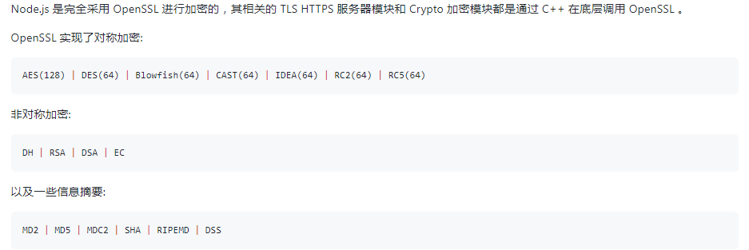

2. [前端性能优化之图片处理](https://juejin.cn/post/6965761736083243044#heading-16)

> 骨架屏、无头浏览器Puppeteer、

3. [大文件上传、断点续传和文件下载](https://github.com/Michael-lzg/my--article/blob/master/other/%E8%B0%88%E8%B0%88%E5%85%B3%E4%BA%8E%E6%96%87%E4%BB%B6%E4%B8%8A%E4%BC%A0%E4%B8%8B%E8%BD%BD%E9%82%A3%E4%BA%9B%E4%BA%8B.md)

> blob 处理二进制文件流

4. [xss 和 csrf](https://juejin.cn/post/6844903638532358151)

5. ssl(secure sockets layer)安全套接层
    tsl(transport layer security)传输层安全协议 定义了对网络发出的数据加密的格式和规则

5. [跨域和解决方式](https://juejin.cn/post/6844903767226351623)

6. [require 和 es6模块化规范](https://zhuanlan.zhihu.com/p/121770261)

7. fastdfs

8. [typescript声明文件](https://zhuanlan.zhihu.com/p/133344957)

    1. [声明文件](https://ts.xcatliu.com/basics/declaration-files.html)
    2. egg-ts-helper egg在应用程序中创建d.ts简单工具  [egg typescript](https://zhuanlan.zhihu.com/p/35334932)

9. react16、高阶组件、redux

10. 富文本编辑器、markdown编辑器

11. [大文件上传和断点续传](https://juejin.cn/post/6844904046436843527#heading-20)

    blob、web worker、spark-md5
