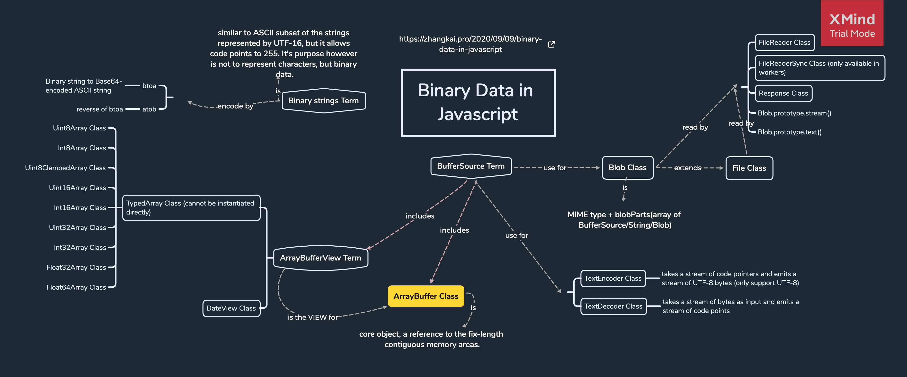

# [详解 FormData 、Blob、File、FileReader、ArrayBuffer、URL、URLSearchParams 对象](https://www.jianshu.com/p/67702e025ede)

Blob(binary large object)、ArrayBuffer、File 可以归为一类，它们都是数据；

FileReader 算是一种工具，用来读取数据；

FormData 可以看做是一个应用数据的场景。

# [Javascript 中的二进制数据](https://zhangkai.pro/2020/09/09/binary-data-in-javascript)



# 二进制数据，文件

1. ArrayBuffer

ArrayBuffer 是核心对象，是对固定长度的连续内存区域的引用。
几乎任何对 ArrayBuffer 的操作，都需要一个视图。

- 视图可以是 TypedArray：Uint8Array，Uint16Array，Uint32Array 等
- 或者 DataView

或者用另外两个术语用于对二进制数据的操作的方法的描述：

- ArrayBufferView：所有视图的总称；
- BufferSource 是 ArrayBuffer 和 ArrayBufferView 的总称。

2. TextDecoder 和 TextEncoder

对用字符串描述的二进制数据进行解码 或 反之。

3. Blob

ArrayBuffer 和 视图是 ECMA 标准的一部分，在浏览器中有其他更高级的对象，如 Blob。

构造器语法：new Blob(blobParts, options);

- blobParts 是数组，可以为 Blob/BufferSou

4. File 和 FileReader

FileReader 用来从blob对象中读取数据。

```js
const file = new FileReader();

/**构造函数的方法有
 * 1. readAsArrayBuffer(blob) —— 将数据读取为二进制格式的 ArrayBuffer。
 * 2. readAsText(blob, [encoding]) —— 将数据读取为给定编码（默认为 utf-8 编码）的文本字符串。
 * 3. readAsDataURL(blob) —— 读取二进制数据，并将其编码为 base64 的 data url。
 * 4. abort() —— 取消操作。
 * / 
```

## Blob 和 File 关系

File 就是 Blob 里面的一个小类，继承 Blob 的方法和属性，附加：

- name：文件名
- lastModified：最后一次修改的时间戳

## atob 和 btoa

1. atob 表示 Base64 字符 to 普通字符，也就是 Base64 解码。(b 即 binary，二进制数据)

2. btoa 反之，表示 base64 编码。

## URL.createObjectURL()与 FileReader.readAsDataURL()

> 什么是 Data Url?
> Data URL，即前缀为 data: 协议的 url，允许像文档中嵌入小文件。
> Data UR 的数据结构：data:[<mediatype>][;base64],<data>

```js data-url 举例：base64编码的字符串


```


1. 将 Blob 作为 URL 资源使用

```js
// createObjectURL：获取指向当前文件的内存url
```

```js
// readAsDataURL：获取base64编码的字符串数据
// FileReader将文件读入内存，并读取文件中的数据。FileReader提供了异步api，可以在浏览器主线程中异步访问文件系统，读取文件中的数据。
// FileReader的result有三种形式，取决于调用读取的方法
```

## 运用

```js
// 将canvas转为base64 toDataURL(toDataURL可以改变图片的质量)
const canvas = document.createElement('canvas');
const ctx = canvas.getContext('2d');
const img = new Image;
img.onload = function(){
    canvas.height = img.height;
    canvas.width = img.width;
    ctx.drawImage(img,0,0);
    const dataURL = canvas.toDataURL('image/png'); //base64格式
};
img.src = url;
```

```js
// canvas转成Blob，toBlob
let img = document.querySelector("img");
let canvas = document.createElement("canvas");
canvas.width = img.clientWidth;
canvas.height = img.clientHeight;

let context = canvas.getContext("2d");
context.drawImage(img, 0, 0);

canvas.toBlob(function (blob) {
  // blob 创建完成，下载它
  let link = document.createElement("a");
  link.download = "example.png";

  link.href = URL.createObjectURL(blob);
  link.click();

  // 删除内部 blob 引用，这样浏览器可以从内存中将其清除
  URL.revokeObjectURL(link.href);
}, "image/png");
```

```js
//将base64转换为blob
dataURLtoBlob: function (dataurl) {
  var arr = dataurl.split(',');
  let mime = arr[0].match(/:(.*?);/)[1];
  let bstr = atob(arr[1]);
  let n = bstr.length;
  let u8arr = new Uint8Array(n);
  while (n--) {
    u8arr[n] = bstr.charCodeAt(n);
  }
  return new Blob([u8arr], {type: mime});
  // return new File([u8arr], "imgName.jpg", {type:mime}); // ie不支持File对象，只有这一行有差异
},
```

```js
// Blob下载到本地
function saveShareContent(content, fileName) {
  let downLink = document.createElement("a");
  downLink.download = fileName;
  //字符内容转换为blod地址
  let blob = new Blob([content]);
  downLink.href = URL.createObjectURL(blob);
  // 链接插入到页面
  document.body.appendChild(downLink);
  downLink.click();
  // 移除下载链接
  document.body.removeChild(downLink);
}
```

```js
//将blob转换为文件，blob比file少了两个属性
blobToFile: function (theBlob, fileName) {
  theBlob.lastModifiedDate = new Date();
  theBlob.name = fileName;
  return theBlob;
}
```

## 综合应用：图片压缩

```js
/**
 * 1. input 读取到 文件 ，使用 FileReader 将其转换为 base64 编码
 * 2. 新建 img ，使其 src 指向刚刚的 base64
 * 3. 新建 canvas ，将 img 画到 canvas 上
 * 4. 利用 canvas.toDataURL/toBlob 将 canvas 导出为 base64 或 Blob
 * 5. 将 base64 或 Blob 转化为 File 
 * 
 */
const maxSize = 2 * 1024 * 1024; // 2M
const maxWidth = 1080;
const maxHeight = 1080;

function compress(base64) {
  // 通过img在canvas绘制压缩图片
  const img = new Image();
  img.onload = () => {
    const canvas = document.createElement("canvas");
    const ctx = canvas.getContext("2d");

    const iw = img.width;
    const ih = img.height;
  };
  img.src = base64;
}

function readFile() {
  const reader = new FileReader();
  reader.onload = (e) => {
    const src = e.target.result; // base64数据
    compress(src);
  };
  reader.readAsDataURL(file); // 读取file文件
}
```
