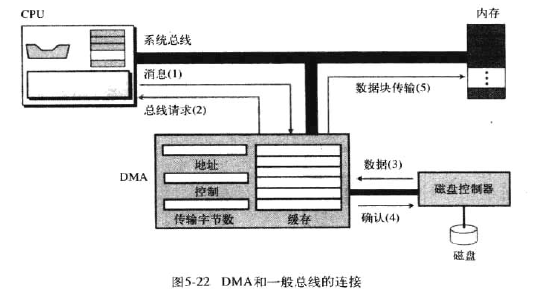

# 计算机硬件(chapter 5 6)

## 计算机组成

计算机 = CPU + 主存 + 输入输出
CPU = ALU + 控制单元（PC + IR） + 寄存器

主存 ≠ 内存，详见存储器层次结构

### CPU

#### ALU

1. 逻辑运算：与 或 非

2. 移位运算：逻辑移位 算术移位

3. 算术运算

#### 寄存器

1. 数据寄存器

2. 指令寄存器（IR）

3. 程序计数器（PC）

#### 控制单元

### 主存

#### 地址空间

> 

#### 存储器类型

1. RAM (radom access) 随机存取存储器，具有易失性。

SRAM (static)：使用触发门电路保存状态，贵

DRAM (dynamic)：使用电容器保持状态

2. ROM (read only) 只读存储器

PROM：可编程

EPROM：可擦除的可编程

EEPROM：电可擦除的可编程

#### 存储器层次结构

主存 -> 高速缓冲存储器 -> 寄存器 （从慢到快，从便宜到贵）

#### 高速缓冲存储器：80-20 规则

### 输入/输出

#### 非存储设备

1. 键盘和显示屏

2. 打印机

#### 存储设备

##### 磁介质

###### 磁盘

1. 物理结构

磁盘、磁头，磁道、扇区

2. 数据存取

最小单位为扇区。随机存取。

3. 性能

决定因素：寻道时间（磁头沿半径方向移动对准磁道）、角速度（磁盘旋转目标扇区至磁头下）、传送时间（磁盘传输至内存）

###### 磁带

1. 物理结构

9 个磁道，磁道上的每个点存储 1 位信息，因此存储 1 个字节信息 + 1 个错误检测位

2. 数据存取

顺序存取。

##### 光介质

###### CD-ROM 只读

1. 制造

坑，文件表面构成主盘，使用聚碳酸酯树脂填充模盘，光盘上覆盖反射层和保护层。

2. 读

根据光驱的**低**能激光束在坑和文件表面的反射不同，驱动器的感应器接收的光信号量不同读出信息。

3. 格式

不同于磁盘

4. 速度

取决于驱动器的速度。

###### CD-R 可刻录 也叫 WORM

1. 制造

染料模拟坑和纹间表面（刻录机的**高**能激光与染料化学反应）。

2. 读

模拟的坑激光束不反射。

###### CD-RW 可擦写

1. 制造

合金材料模拟坑和纹间表面。

2. 擦除

驱动器使用中等能量激光束将坑变成纹间表面。激光束将改点从无定型状态转变为晶体态。

###### DVD 数字多功能光盘

与 CD-ROM 相比，坑更小，磁道更紧密，激光束使用红激光代替红外激光，使用 1 到 2 个存储层（单面或双面）。因此容量更大，使用 MPEG 压缩技术。

### 子系统互连

#### CPU 与存储器的连接

1. 数据总线
2. 地址总线
3. 控制总线

#### I/O 设备的连接

I/O 设备需要通过输入输出控制器连接到总线上

##### SCSI：并行接口

##### 火线：串行接口

##### USB：通用串行总线

1. USB 使用 4 根电缆：两根线（+5V 和地）用来为低压设备提供高压，两根传送数据、地址和控制信号；
2. USB 使用两种不同的连接头，A（下游连接器）和 B（上游连接器）。A 是矩形，连接 USB 控制器；B 是方形，连接设备。
3. USB-2 提供三种传送速率：1.5Mbps，12Mbps 和 480Mbps。低速率用于低速设备如鼠标，中速率用于打印机，高速率用于大容量存储设备。
4. 通过 USB 的数据是以包的形式传输的。每个包含有：地址部分（设备标识）、控制部分、要被传输到设备的数据部分。所有设备都将接收到相同的包，但是只有具有数据包中定义的地址的设备才能接收它。

#### I/O 设备的寻址

CPU 与 I/O 或 主存之间地址总线的寻址。

##### I/O 独立寻址

每个 I/O 设备有自己独立的地址；读/写内存和读/写 I/O 的指令不同。

##### I/O 存储器映射寻址

CPU 将 I/O 控制器的每一个寄存器当成内存中的存储字；CPU 没有单独的指令标识是从**内存**还是 **I/O** 传送数据，如果地址指定的是内存的单元则从内存中读取数据，如果指定的是 I/O 中的某个寄存器，则从寄存器中读取数据。

### 程序执行

通用计算机使用成为程序的一系列指令来处理数据。计算机通过程序，将输入数据转为输出数据。程序和数据都存放在内存中。

#### 机器周期

CPU 利用重复的机器周期执行程序中的指令。机器周期包括三步：

1. 取指令

   控制单元、CPU 的指令寄存器、程序计数器

2. 译码

   控制单元

3. 执行

   控制单元、CPU 某个部件（如：告知 CPU 从内存取数据、让 ALU 将输入寄存器的内容相加并将结果保存在输出寄存器）

#### 输入/输出操作

由于输入输出设备的运行速度比 CPU 慢，CPU 操作与输入/输出设备同步的方法：

##### 程序控制输入/输出

CPU 等待 I/O；CPU 不时查询 I/O 驱动器状态，直至设备做好传输准备；数据在输入操作后被传送至**内存**。

##### 中断控制输入/输出

CPU 告知设备即将传输，设备准备好后中断 CPU（CPU 监听中断）；数据在输入操作后被传送至**内存**。

##### DMA（direct memory access）

用于在高速 I/O **设备间**，例如：磁盘、内存（不需要通过 CPU 数据传输），传输大量的数据块；DMA 承担了 CPU 的工作；CPU 给 DMA 传输的数据包括：传输类型（输入或输出）、内存单元的起始地址、传输的字节数。

### 不同的体系结构

#### CISC（complex instruction set computer）

英特尔奔腾系列。策略：使用大量指令。程序设计简单。

1. CPU 不直接执行机器语言指令，只执行被称为微操作的简单操作，复杂指令需要被转化为一系列简单操作再由 CPU 执行。
2. 这种执行机制需要一个被称为微内存的特殊内存，它负责保存机器集中每个复杂指令对应的一系列操作。

#### RISC （reduce instruction set computer）

策略：使用少量指令完成最少的简单操作。程序设计难且费时。

#### 流水线

允许属于不同指令的不同阶段（取址、译码、执行）同时执行，提高计算机的吞吐量（单位时间处理指令的数量）。

#### 并行处理

计算机具有多个控制单元、多个 ALU 单元，多个内存单元，则可以并行处理。按照计算机组织，可以分为四类。

CU：控制单元 PU：处理单元 MU：内存单元

##### SISD 单指令流，单数据流

##### SIMD

多个 PU。所有处理单元从控制单元接收相同的指令，分别在不同的数据项上操作。

##### MISD

未被实现。

##### MIMD

多个指令流的多个指令作用于多个数据流（每条指令作用一个数据项）。可以使用多个内存区或共享内存。

### 简单计算机

计算机= CPU + 主存 + I/O
CPU = 控制单元 + ALU + 数据寄存器

1. CPU

控制单元：控制 ALU 操作，对内存和 I/O 的存取；有两个专用寄存器：PC（下一条指令的主存的存储单元的地址） 和 IR（当前周期译码的指令）。
数据寄存器：**16 个**16 位的数据寄存器。大多指令中，存储数据；有些指令也可能含有其他信息。

2. 主存：既有数据，也有指令。**256 个**16 位的存储单元。

3. I/O 子系统：I/O 设备有内存映射地址。

#### 指令集

简单计算机有 16 条指令，只使用其中 14 条；每条指令 16 位，被分成 4 位的 4 个域。指令 = 操作码 + 操作数，寄存器地址占**1 个**域，内存地址则需要占**2 个**域。

#### 处理指令

#### 一个例子

为了遵循冯诺依曼模型，程序和数据需要存储在内存中。

#### 另一个例子

输入操作必须从输入设备读数据到内存，输出操作必须从内存到输出设备。
