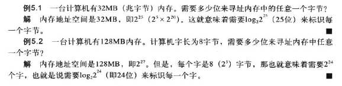

# 计算机硬件(chapter 5 6)

## 计算机组成

计算机 = CPU + 主存 + 输入输出
CPU = ALU + 控制单元（PC + IR） + 寄存器

### CPU

#### ALU

1. 逻辑运算：与 或 非

2. 移位运算：逻辑移位 算术移位

3. 算术运算

#### 寄存器

1. 数据寄存器

2. 指令寄存器

3. 程序计数器

#### 控制单元

### 主存

#### 地址空间

> 

#### 存储器类型

1. RAM (radom access) 随机存取存储器，具有易失性。

SRAM (static)：使用触发门电路保存状态，贵

DRAM (dynamic)：使用电容器保持状态

2. ROM (read only) 只读存储器

PROM：可编程

EPROM：可擦除的可编程

EEPROM：电可擦除的可编程

#### 存储器层次结构

主存 -> 高速缓冲存储器 -> 寄存器 （从慢到快，从便宜到贵）

#### 高速缓冲存储器：80-20 规则

### 输入/输出

#### 非存储设备

1. 键盘和显示屏

2. 打印机

#### 存储设备

##### 磁介质

###### 磁盘

1. 物理结构

磁盘、磁头，磁道、扇区

2. 数据存取

最小单位为扇区。随机存取。

3. 性能

决定因素：寻道时间（磁头沿半径方向移动对准磁道）、角速度（磁盘旋转目标扇区至磁头下）、传送时间（磁盘传输至内存）

###### 磁带

1. 物理结构

9 个磁道，磁道上的每个点存储 1 位信息，因此存储 1 个字节信息 + 1 个错误检测位

2. 数据存取

顺序存取。

##### 光介质

###### CD-ROM 只读

1. 制造

坑，文件表面构成主盘，使用聚碳酸酯树脂填充模盘，光盘上覆盖反射层和保护层。

2. 读

根据光驱的**低**能激光束在坑和文件表面的反射不同，驱动器的感应器接收的光信号量不同读出信息。

3. 格式

不同于磁盘

4. 速度

取决于驱动器的速度。

###### CD-R 可刻录 也叫 WORM

1. 制造

染料模拟坑和纹间表面（刻录机的**高**能激光与染料化学反应）。

2. 读

模拟的坑激光束不反射。

###### CD-RW 可擦写

1. 制造

合金材料模拟坑和纹间表面。

2. 擦除

驱动器使用中等能量激光束将坑变成纹间表面。激光束将改点从无定型状态转变为晶体态。

###### DVD 数字多功能光盘

与 CD-ROM 相比，坑更小，磁道更紧密，激光束使用红激光代替红外激光，使用 1 到 2 个存储层（单面或双面）。因此容量更大，使用 MPEG 压缩技术。

### 子系统互连

#### CPU 与存储器的连接

1. 数据总线
2. 地址总线
3. 控制总线

#### I/O 设备的连接

I/O 设备需要通过输入输出控制器连接到总线上

##### SCSI：并行接口

##### 火线：串行接口

##### USB：通用串行总线

1. USB 使用 4 根电缆：两根线（+5V 和地）用来为低压设备提供高压，两根传送数据、地址和控制信号；
2. USB 使用两种不同的连接头，A（下游连接器）和 B（上游连接器）。A 是矩形，连接 USB 控制器；B 是方形，连接设备。
3. USB-2 提供三种传送速率：1.5Mbps，12Mbps 和 480Mbps。低速率用于低速设备如鼠标，中速率用于打印机，高速率用于大容量存储设备。
4. 通过 USB 的数据是以包的形式传输的。每个包含有：地址部分（设备标识）、控制部分、要被传输到设备的数据部分。所有设备都将接收到相同的包，但是只有具有数据包中定义的地址的设备才能接收它。

#### I/O 设备的寻址

CPU 与 I/O 和 主存之间地址总线的寻址。

##### I/O 独立寻址

每个I/O设备有自己独立的地址；读/写内存和读/写I/O的指令不同。

##### I/O 存储器映射寻址

CPU将I/O控制器的每一个寄存器当成内存中的存储字；CPU没有单独的指令标识是从内存还是I/O传送数据，如果地址指定的是内存的单元则从内存中读取数据，如果指定的是I/O中的某个寄存器，则从寄存器中读取数据。

### 程序执行